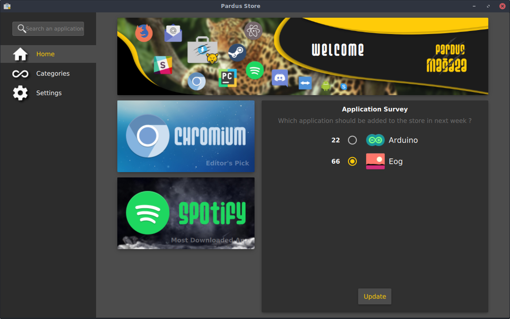
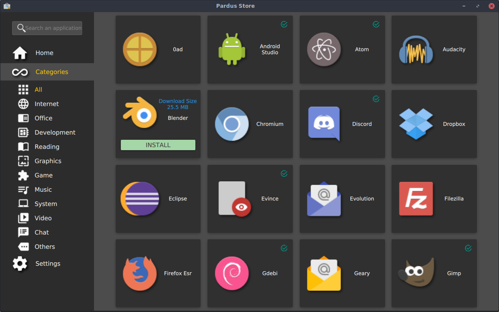
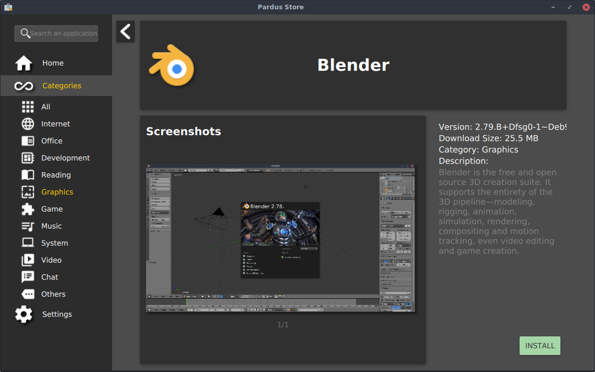
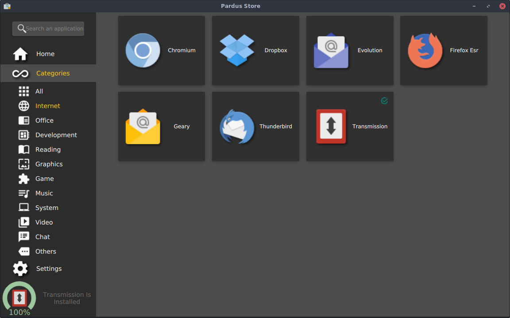
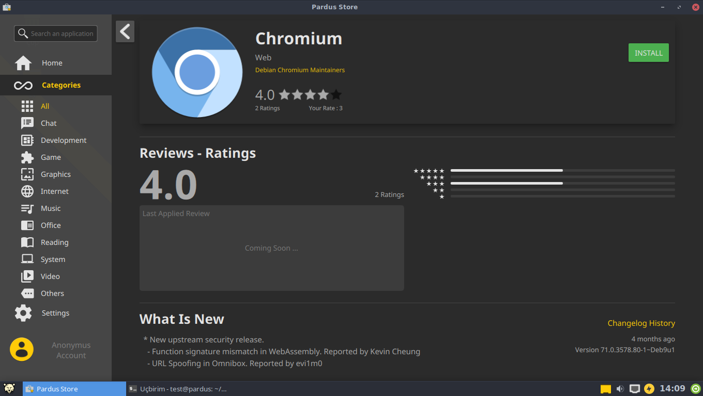
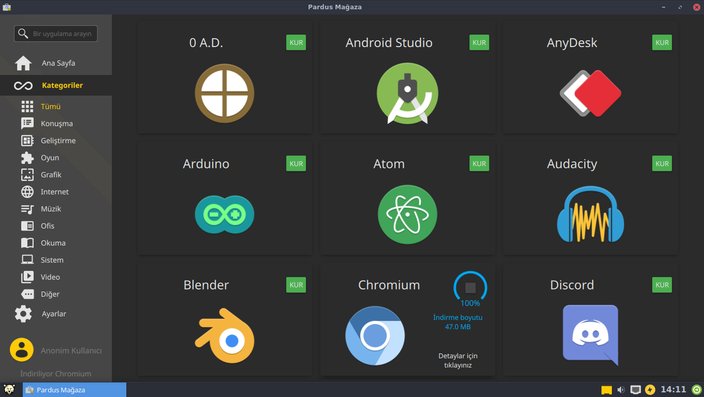
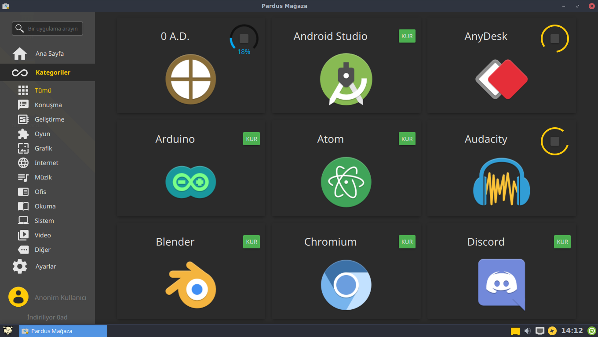

# Pardus Store

Pardus Store is an application store front-end for debian based operating systems.

It is currently a work in progress. Maintenance is done by [Pardus](https://pardus.org.tr) team.

Currently the server side of the store is on a test environment and can be updated to a dedicated server in the future.

You can join the discussion on [Pardus Forums](https://forum.pardus.org.tr/t/pardus-magaza-beta-surumu-yayinlandi/4768/426).

## Screen Shots

### On Linux (Pardus 17.4 GNU/Linux)

