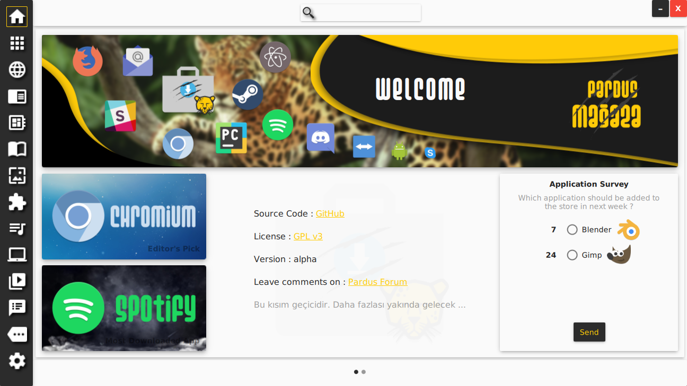
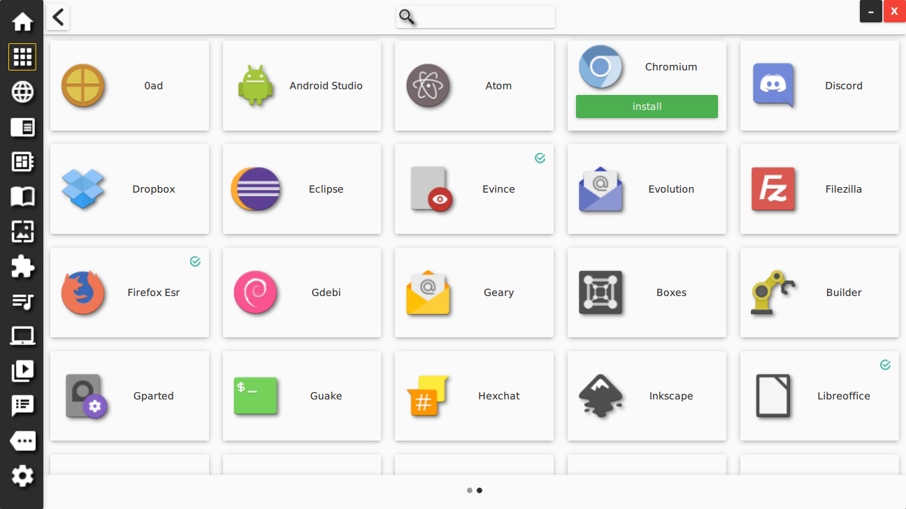

# Pardus Store

Qt5-based, nice-looking, simple-to-use, responsive application store designed
for Debian systems.




## Build & Run

Please see [prerequisites](debian/control) for building and running Pardus
Store. Please note that you should have Debian Testing or equivalent disto to
satisfy these requirements from your distro repository.

Once you have the dependencies, build with

```
cd path/to/pardus-store
mkdir build && cd build
cmake -G "Unix Makefiles" -DCMAKE_INSTALL_PREFIX=/usr ..
# Build
make
# Install
sudo make install
```

You should run Pardus Store with `sudo`.

```
cd build
sudo ./pardus-store
```

## Packaging

**TODO**
